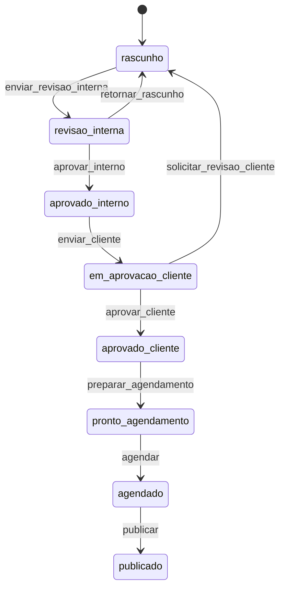
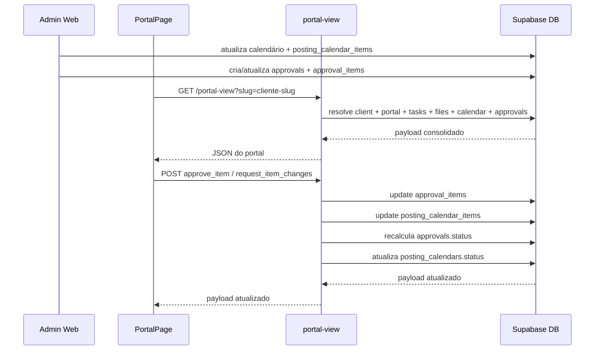
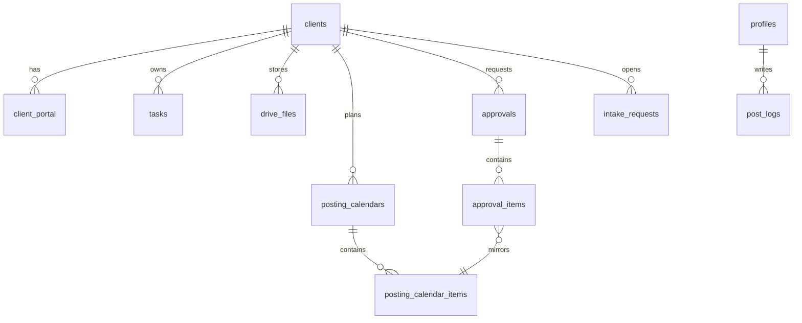

# Plano técnico e entregáveis para transformar o portal do cliente em um SaaS de marketing funcional

## Resumo executivo

A leitura do ZIP mostra um projeto React + Vite + Supabase com base boa, mas com três gargalos estruturais que hoje impedem o portal do cliente de parecer e funcionar como produto SaaS: o portal público está centrado em um `PortalPage.tsx` monolítico e incompleto, a Edge Function `portal-view` ainda entrega um shape inconsistente e sem bundle real de aprovações, e parte das escritas públicas do portal ainda tenta ir direto ao banco com cliente `anon`, o que entra em conflito com RLS e com a própria ideia de portal público. Em Supabase, isso é sensível porque RLS é aplicado como uma espécie de `WHERE` automático em toda consulta/escrita, e tabelas expostas sem policy adequada caem em negação por padrão; já Edge Functions públicas exigem validação manual do seu “token/slug” porque, quando você não usa verificação automática de JWT, a responsabilidade de autorização fica no código da função. citeturn3view0turn3view1turn3view2turn3view10

A prioridade correta é exatamente a que você definiu: primeiro `PortalPage` + `portal-view` + URL por slug, porque isso destrava o portal visível ao cliente e elimina a maior parte dos botões “sem ação”. Na sequência, vem o fluxo oficial de aprovação via calendário, alinhando `posting_calendar_items`, `approvals` e `approval_items` para que o cliente aprove post a post dentro do portal, e só depois entram a revisão ampla de queries, paginação, selects excessivos e índices. Isso acompanha as práticas oficiais do ecossistema Supabase/PostgREST: selecionar apenas colunas necessárias, paginar com `.range()`, usar embedding de recursos relacionados para reduzir round-trips, e alinhar índices com filtros, joins e `order by`. citeturn3view4turn3view5turn3view6turn5view0

Na inspeção do ZIP `admin pt-br(6).zip` — que é idêntico ao `admin pt-br(5).zip` pelo hash — os pontos mais críticos são estes: `src/pages/PortalPage.tsx` tem 771 linhas e **não renderiza nenhuma aba de aprovação**, embora o menu mostre “Aprovação”; `supabase/functions/portal-view/index.ts` tem 666 linhas e **não retorna pacotes de aprovação**, apenas calendário/tarefas/arquivos; `src/pages/PostingCalendarHomePage.tsx` faz um envio cego com três transições fixas por item, o que quebra quando um item já está em `em_aprovacao_cliente`; `src/services/posting-calendar.service.ts` tem um caminho de leitura que **cria calendários** enquanto tenta apenas consultar; e `update_portal_tokens_and_restrictions.sql` converteu `portal_token` em UUID, que é justamente a raiz da URL feia. Além disso, o helper `public.is_admin()` no SQL-base ainda verifica role legado `admin`, enquanto seu modelo atual já usa `admin_estrategico`, `admin_operacional` e `sistema`, produzindo desalinhamento entre app, RLS e Edge Functions.

## Análise do ZIP e diagnóstico dos riscos

Na estrutura do ZIP, os arquivos mais críticos para o escopo pedido aparecem claramente: `src/pages/PortalPage.tsx`, `supabase/functions/portal-view/index.ts`, `src/services/_shared.ts`, `src/services/portal.service.ts`, `src/pages/PostingCalendarHomePage.tsx`, `src/services/posting-calendar.service.ts`, `src/services/content-approval.service.ts`, `src/services/public-approval.service.ts`, `src/hooks/useClientHub.ts`, `src/pages/ClientHubPage.tsx`, `supabase_schema.sql`, `migration_agency_os.sql` e as migrations de workflow/roles. Também há sinais de dívida técnica de pacote/exportação: arquivos estranhos na raiz como `(`, `({`, `void`, e duplicação lógica como `src/lib/activity-feed.ts` e `src/lib/activityFeed.ts`, além de duplicação de `PortalService`/`buildPortalUrl` entre `src/services/services.ts`, `src/services/portal.service.ts` e `src/services/_shared.ts`.

Pelo `package.json` do ZIP, a stack é contemporânea e coerente para o objetivo: React 19, React Router 7, Supabase JS 2.101, TanStack Query 5, Framer Motion 12, Lucide React e Vite 6. Isso significa que o problema principal não é tecnologia insuficiente; é principalmente **coerência de fluxo, RLS, shape de payload e separação de responsabilidades**.

Os riscos técnicos imediatos observados no código são objetivos. `PortalPage.tsx` tem menu com `overview`, `tasks`, `calendar`, `approval`, `files`, `request`, mas só renderiza `overview`, `tasks`, `files`, `calendar` e `request`; a aba `approval` simplesmente não existe no body. `PortalPage` também envia solicitações com `supabase.from('intake_requests').insert(...)` a partir do browser público, o que tende a falhar se a policy exigir `auth.uid()` ou outro predicado restritivo. Em `portal-view`, o lookup aceita `token` e faz fallback comparando `slugify(client.name)` em memória, mas o retorno não inclui lista de aprovações nem itens de `approval_items`; no `POST`, a função só lida com decisão de calendário por inteiro, não com aprovação post a post. Esse desenho conflita com o workflow oficial que você definiu e com a experiência esperada do cliente. Pelo lado de performance, `portal-view` ainda faz N+1 no Google Drive ao checar arquivo por arquivo, enquanto `PostingCalendarService.getByClientAndDateRange()` faz loop por mês e chama `getOrCreateCalendar()`, isto é, uma leitura de hub pode acabar gerando registros “draft” por efeito colateral.

Na parte de segurança/dados, o risco maior não é “RLS demais”, mas **RLS incoerente**. O schema-base já liga RLS em várias tabelas, e isso é correto para tabelas expostas no schema público. O problema é que suas policies e helpers não acompanham o modelo novo de roles. No estado atual do ZIP, `public.is_admin()` ainda avalia `role = 'admin'`, enquanto o app já trabalha com `admin_estrategico`, `admin_operacional`, `gestor`, `social_media`, `equipe`, `cliente`, `sistema`, `blocked`. Isso explica parte de sintomas como 403/500, e é exatamente o tipo de desalinhamento que gera login quebrado, escrita barrada e políticas “arrumadas na mão” que acabam entrando em recursão. O desenho recomendado pela documentação é usar helper functions `SECURITY DEFINER` com `search_path` controlado para evitar custo/recursão na policy, e não duplicar consultas complexas dentro do `USING`/`WITH CHECK`. citeturn3view1turn3view7turn3view8turn2search2

Um detalhe importante do diagnóstico: o erro antigo dos “emoji tags” (`<📊>`, `<✓>`, etc.) **não aparece mais neste ZIP** no componente analisado do hub (`ClientSummaryStrip.tsx`), que agora usa ícones Lucide. Então isso deve ser tratado como bug de uma revisão anterior ou de arquivo fora desse artefato; vale revisar imports antigos e bundles cacheados, mas não gastar a frente principal nisso.

## Plano de ação técnico por prioridade

O primeiro bloco de execução deve ser curto e cirúrgico. Reverter o conceito de portal para slug humano no próprio campo `clients.portal_token` é suficiente e evita criar coluna nova. O schema já suporta isso porque `portal_token` é `text unique`; o pior desvio recente foi o script `update_portal_tokens_and_restrictions.sql`, que forçou UUIDs em massa. O ajuste correto é fazer backfill determinístico por nome, com `unaccent`, normalização para kebab-case e sufixo para colisões. Ao mesmo tempo, `buildPortalUrl()` e `PortalService.generateForClient()` devem passar a tratar `portal_token` como slug público, não como UUID aleatório. Com isso, a URL vira `/portal/carla-hammes` sem expansão de schema.

O segundo bloco é centralizar **todas as escritas públicas do portal** em `portal-view`. Isso inclui aprovar item, solicitar alteração e abrir solicitação. Não é apenas uma preferência arquitetural: com RLS ativo e portal público sem sessão autenticada, deixar o browser escrever direto em `intake_requests`, `approval_items` ou `posting_calendar_items` fica frágil por definição. A Edge Function pública pode continuar pública, mas precisa validar manualmente o slug/token do portal, restringir a atuação ao cliente resolvido e executar somente as mutações previstas pela regra de negócio. Essa abordagem está alinhada com a recomendação da documentação de Edge Functions, especialmente quando a verificação não é delegada automaticamente a JWT. citeturn3view2turn3view10turn3view3

O terceiro bloco é corrigir o workflow via calendário. O erro “`em_aprovacao_cliente -> enviar_revisao_interna`” nasce de uma premissa errada no `handleSendApproval`: o código atual tenta aplicar sempre as três transições para todos os posts, mesmo quando o item já está mais avançado. O certo é fazer branch por estado atual: `rascunho` recebe 3 passos, `revisao_interna` recebe 2, `aprovado_interno` recebe 1, e `em_aprovacao_cliente` é ignorado. Depois disso, cria-se ou atualiza-se o pacote em `approvals`/`approval_items`. Como o fluxo oficial já está modelado em `src/domain/postWorkflow.ts`, o conserto é sobretudo de orquestração no front e de consistência no write-path.

O quarto bloco é o “arrasto” de queries e RLS. Em Supabase, a combinação mais eficiente em muitos cenários é: `select()` com colunas estritas, `range()` para paginação, filtros e `order` determinísticos, além de embedding/join via PostgREST quando há relações claras. Isso reduz o número de chamadas e o payload transferido. No seu caso, as prioridades mais óbvias são `ClientService.getAll()` que usa `select('*')`, `PostingCalendarService.getByClientAndDateRange()` que cria registros durante leitura e faz loop mensal, `portal-view` que chama o Drive por arquivo, e qualquer tela/lista sem `.range()` nem dados contados separados. citeturn3view4turn3view5turn3view6turn6view0

Os comandos e patches práticos desse bloco inicial ficam assim:

```bash
npm run lint
npm run build
npm run supabase:db:push
npx supabase functions deploy portal-view --no-verify-jwt
```

```sql
-- supabase/migrations/20260416_portal_slug_backfill.sql
create extension if not exists unaccent;

with normalized as (
  select
    c.id,
    c.created_at,
    nullif(
      trim(both '-' from regexp_replace(lower(unaccent(coalesce(c.name, ''))), '[^a-z0-9]+', '-', 'g')),
      ''
    ) as base_slug
  from public.clients c
),
ranked as (
  select
    n.id,
    case
      when n.base_slug is null then 'cliente-' || substr(n.id::text, 1, 8)
      when row_number() over (partition by n.base_slug order by n.created_at, n.id) = 1 then n.base_slug
      else n.base_slug || '-' || row_number() over (partition by n.base_slug order by n.created_at, n.id)
    end as final_slug
  from normalized n
)
update public.clients c
set portal_token = r.final_slug
from ranked r
where c.id = r.id
  and (
    c.portal_token is null
    or c.portal_token ~ '^[0-9a-f]{8}-[0-9a-f]{4}-[0-9a-f]{4}-[0-9a-f]{4}-[0-9a-f]{12}$'
  );
```

```ts
// src/services/_shared.ts
export const buildPortalUrl = (reference: string, clientName?: string | null) => {
  const slug = slugify(clientName || reference) || String(reference || '').trim();
  const basePath = String(import.meta.env.BASE_URL || '/').replace(/\/?$/, '/');
  const normalizedPath = `${basePath}portal/${encodeURIComponent(slug)}`;
  if (typeof window === 'undefined') return normalizedPath;
  return new URL(normalizedPath, window.location.origin).toString();
};
```

```ts
// src/services/portal.service.ts
const desiredToken = payload?.token || clientRow?.name || `cliente-${clientId}`;
const token = await ensureUniquePortalToken(desiredToken, clientId);
```

```tsx
// src/App.tsx
<Route path="/portal/:slug" element={<PortalPage />} />
```

## Arquivos a alterar e por quê

O conjunto mínimo de arquivos para resolver o problema real é relativamente enxuto.

`src/pages/PortalPage.tsx` precisa ser refeito porque hoje é um monólito incompleto: a aba de aprovação não existe, a aba de solicitar tenta escrever direto no banco público, o lookup usa `token` no route param e o layout não conversa bem com a operação de marketing.

`supabase/functions/portal-view/index.ts` é o segundo arquivo crítico porque hoje ele não devolve o pacote de aprovações, não resolve o portal por slug de forma canônica, não cria solicitações pelo portal e trabalha com ações de calendário por inteiro, em vez de aprovação item a item.

`src/services/_shared.ts` e `src/services/portal.service.ts` precisam ser alinhados porque hoje há helper de URL divergente, geração de portal baseada em referência feia e chamada com assinatura inconsistente.

`src/pages/PostingCalendarHomePage.tsx` precisa de correção no `handleSendApproval` para parar de tentar transicionar todo item sempre pelos mesmos três passos.

`src/services/posting-calendar.service.ts` precisa de revisão porque o método `getByClientAndDateRange()` está fazendo leitura com efeito colateral e N+1 mensal.

`src/services/content-approval.service.ts` e `src/services/public-approval.service.ts` precisam ser alinhados na segunda camada porque hoje existem write-paths paralelos para aprovação. O melhor desenho é manter um único comportamento semântico: item aprovado no portal atualiza `approval_items`, reflete em `posting_calendar_items` e recalcula o status do pacote `approvals`.

`supabase_schema.sql`, `migration_agency_os.sql` e uma migration nova de RLS precisam entrar no pacote porque o helper `is_admin()` e parte das policies ainda falam a língua do papel legado `admin`, enquanto o app já fala `admin_estrategico`/`admin_operacional`/`sistema`. Além disso, a documentação de Supabase recomenda helper `SECURITY DEFINER` com cuidado especial de `search_path`, e o Postgres deixa claro que políticas sem match resultam em default-deny em tabelas com RLS habilitado. citeturn3view1turn3view7turn3view8

Os arquivos ausentes ou “não especificados” que idealmente existiriam, mas não aparecem no ZIP, são uma suíte mínima de testes automatizados, testes de integração para o portal e uma camada centralizada de helpers de URL pública. Como não existem no artefato, o plano abaixo pressupõe criação desses testes, não alteração de algo já pronto.

## SQL, RLS e revisão de queries Supabase

A correção de RLS deve começar por helpers em schema privado, porque a documentação atual do Supabase desaconselha criar funções `SECURITY DEFINER` em schemas expostos. O objetivo aqui é duplo: evitar recursão/peso desnecessário nas policies e alinhar o banco ao modelo de roles que o app já usa. citeturn3view7turn3view8

```sql
-- supabase/migrations/20260416_rls_roles_and_portal_fix.sql
create extension if not exists unaccent;

create schema if not exists private;
revoke all on schema private from public;
grant usage on schema private to authenticated, anon;

create or replace function private.has_full_access()
returns boolean
language sql
stable
security definer
set search_path = public, pg_temp
as $$
  select exists (
    select 1
    from public.profiles p
    where p.id = auth.uid()
      and p.active is true
      and (
        p.access_scope = 'full'
        or p.role in ('admin_estrategico', 'admin_operacional', 'sistema')
      )
  );
$$;

create or replace function private.is_internal_user()
returns boolean
language sql
stable
security definer
set search_path = public, pg_temp
as $$
  select exists (
    select 1
    from public.profiles p
    where p.id = auth.uid()
      and p.active is true
      and p.role in (
        'admin_estrategico',
        'admin_operacional',
        'gestor',
        'social_media',
        'equipe',
        'sistema'
      )
  );
$$;

grant execute on function private.has_full_access() to authenticated, anon;
grant execute on function private.is_internal_user() to authenticated, anon;

alter table if exists public.profiles
  drop constraint if exists profiles_role_check;

alter table if exists public.profiles
  add constraint profiles_role_check
  check (
    role in (
      'admin_estrategico',
      'admin_operacional',
      'gestor',
      'social_media',
      'equipe',
      'cliente',
      'sistema',
      'blocked'
    )
  );

create or replace function public.is_admin()
returns boolean
language sql
stable
security definer
set search_path = public, pg_temp
as $$
  select (select private.has_full_access());
$$;

alter table if exists public.profiles enable row level security;
alter table if exists public.system_settings enable row level security;
alter table if exists public.post_logs enable row level security;
alter table if exists public.posting_calendar_items enable row level security;
alter table if exists public.approvals enable row level security;
alter table if exists public.approval_items enable row level security;

drop policy if exists profiles_select on public.profiles;
drop policy if exists profiles_update on public.profiles;
drop policy if exists profiles_insert on public.profiles;
drop policy if exists profiles_read_self_or_full on public.profiles;
drop policy if exists profiles_update_self_or_full on public.profiles;
drop policy if exists profiles_insert_self_or_full on public.profiles;

create policy profiles_read_self_or_full
  on public.profiles
  for select
  to authenticated
  using (
    id = auth.uid()
    or (select private.has_full_access())
  );

create policy profiles_update_self_or_full
  on public.profiles
  for update
  to authenticated
  using (
    id = auth.uid()
    or (select private.has_full_access())
  )
  with check (
    id = auth.uid()
    or (select private.has_full_access())
  );

create policy profiles_insert_self_or_full
  on public.profiles
  for insert
  to authenticated
  with check (
    id = auth.uid()
    or (select private.has_full_access())
  );

drop policy if exists system_settings_admin on public.system_settings;
drop policy if exists system_settings_full_access on public.system_settings;

create policy system_settings_full_access
  on public.system_settings
  for all
  to authenticated
  using ((select private.has_full_access()))
  with check ((select private.has_full_access()));

drop policy if exists post_logs_full_access on public.post_logs;
create policy post_logs_full_access
  on public.post_logs
  for all
  to authenticated
  using ((select private.is_internal_user()))
  with check ((select private.is_internal_user()));

drop policy if exists calendar_items_full_access on public.posting_calendar_items;
create policy calendar_items_full_access
  on public.posting_calendar_items
  for all
  to authenticated
  using ((select private.is_internal_user()))
  with check ((select private.is_internal_user()));

drop policy if exists approvals_full_access on public.approvals;
create policy approvals_full_access
  on public.approvals
  for all
  to authenticated
  using ((select private.is_internal_user()))
  with check ((select private.is_internal_user()));

drop policy if exists approval_items_internal_full_access on public.approval_items;
create policy approval_items_internal_full_access
  on public.approval_items
  for all
  to authenticated
  using ((select private.is_internal_user()))
  with check ((select private.is_internal_user()));
```

As queries do app inteiro devem seguir a mesma linha. O ponto principal é trocar `select('*')` por seleção vertical explícita, usar `.range()` onde houver listas, e consolidar relações quando fizer sentido com embedding, porque o PostgREST suporta retornar recursos relacionados numa mesma chamada a partir das foreign keys, reduzindo o número de round-trips. O limite padrão de retorno do Supabase também reforça a necessidade de paginação consistente. citeturn3view4turn3view5turn3view6turn6view0

Os principais ajustes de query que merecem entrar já na próxima camada são estes:

```ts
// src/services/posting-calendar.service.ts
// problema curto: leitura com efeito colateral + N+1 mensal
async getByClientAndDateRange(clientId: string, startDate: Date, endDate: Date) {
  const startIso = new Date(startDate).toISOString();
  const endIso = new Date(endDate).toISOString();

  const { data: calendars, error: calendarError } = await supabase
    .from('posting_calendars')
    .select('id')
    .eq('client_id', clientId)
    .gte('year', startDate.getFullYear() - 1)
    .lte('year', endDate.getFullYear() + 1);

  if (calendarError) throw calendarError;

  const calendarIds = (calendars || []).map((row) => row.id);
  if (!calendarIds.length) return [];

  const { data: items, error: itemsError } = await supabase
    .from('posting_calendar_items')
    .select('id, calendar_id, post_date, day_number, post_type, title, description, image_url, video_url, workflow_status, approval_status')
    .in('calendar_id', calendarIds)
    .gte('post_date', startIso)
    .lte('post_date', endIso)
    .order('post_date', { ascending: true });

  if (itemsError) throw itemsError;
  return items || [];
}
```

```sql
-- índices recomendados para o fluxo portal/aprovação
create index if not exists idx_posting_calendars_client_year_month
  on public.posting_calendars(client_id, year desc, month desc);

create index if not exists idx_posting_calendar_items_calendar_day
  on public.posting_calendar_items(calendar_id, day_number);

create index if not exists idx_posting_calendar_items_calendar_workflow
  on public.posting_calendar_items(calendar_id, workflow_status, approval_status);

create index if not exists idx_approvals_client_status_created
  on public.approvals(client_id, status, created_at desc);

create index if not exists idx_approval_items_approval_status_sort
  on public.approval_items(approval_id, status, sort_order);

create index if not exists idx_intake_requests_client_created
  on public.intake_requests(client_id, created_at desc);
```

## Exemplos completos prontos para colar

### Arquivo

`src/pages/PortalPage.tsx`

### Problema curto

Portal monolítico, sem aba real de aprovação, com escrita pública direta no banco e URL ainda tratada como token em vez de slug.

```tsx
import React, { useEffect, useMemo, useState } from 'react';
import {
  ArrowRight,
  Building2,
  CalendarClock,
  CheckCircle2,
  Clock3,
  ExternalLink,
  Files,
  FolderKanban,
  HardDrive,
  LayoutDashboard,
  Loader2,
  MessageSquarePlus,
  Search,
  Send,
} from 'lucide-react';
import { format } from 'date-fns';
import { ptBR } from 'date-fns/locale';
import { useParams } from 'react-router-dom';
import PostingCalendarTemplateClassic from '@/components/posting-calendar/PostingCalendarTemplateClassic';
import {
  ApprovalTone,
  WorkflowTone,
  buildMonthCells,
  normalizeWorkflowStatusId,
  type PostingCalendarItemRecord,
  type PostingCalendarRecord,
} from '@/components/posting-calendar/PostingCalendarShared';
import { normalizePostingCalendarTemplateConfig } from '@/domain/agencyPlatform';
import { cn } from '@/utils/cn';
import { toast } from '@/components/ui/sonner';

type PortalTab = 'overview' | 'tasks' | 'planning' | 'approval' | 'drive' | 'request';

type PortalTask = {
  id: string;
  title: string;
  description: string;
  status: string;
  priority: string;
  due_date: string | null;
  assignee_name?: string | null;
};

type PortalFile = {
  id: string;
  name: string;
  mime_type: string;
  size: number;
  version?: number;
  preview_url: string;
  download_url: string;
};

type PortalApprovalItem = {
  id: string;
  approval_id: string;
  calendar_post_id: string | null;
  title: string;
  content: string | null;
  media_url: string | null;
  platform: string;
  scheduled_date: string | null;
  status: 'pending' | 'approved' | 'rejected' | 'revision_requested';
  feedback: string | null;
  reviewer_name: string | null;
  decided_at: string | null;
  workflow_status?: string | null;
  approval_status?: string | null;
  revision_count?: number | null;
};

type PortalApproval = {
  id: string;
  title: string;
  description: string | null;
  status: string;
  due_date: string | null;
  items: PortalApprovalItem[];
};

type PortalPayload = {
  portal: {
    id: string;
    slug: string;
    token: string;
    is_active: boolean;
    expires_at: string | null;
  };
  portal_links: {
    url: string;
    slug: string;
  };
  client: {
    id: string;
    name: string;
    logo_url?: string | null;
    phone?: string | null;
  };
  branding?: {
    logo_url?: string | null;
  };
  tasks: PortalTask[];
  files: PortalFile[];
  calendar: PostingCalendarRecord | null;
  calendar_items: PostingCalendarItemRecord[];
  calendar_template: unknown;
  planning?: {
    id: string;
    conteudo?: Record<string, unknown> | null;
  } | null;
  approvals: PortalApproval[];
  permissions: {
    can_download: boolean;
    can_preview: boolean;
  };
};

const TABS: Array<{ id: PortalTab; label: string; icon: React.ComponentType<{ size?: number }>; }> = [
  { id: 'overview', label: 'Início', icon: LayoutDashboard },
  { id: 'tasks', label: 'Tarefas', icon: FolderKanban },
  { id: 'planning', label: 'Planejamento', icon: CalendarClock },
  { id: 'approval', label: 'Aprovação', icon: CheckCircle2 },
  { id: 'drive', label: 'Drive', icon: HardDrive },
  { id: 'request', label: 'Solicitar', icon: MessageSquarePlus },
];

const formatShortDate = (value?: string | null) => {
  if (!value) return '—';
  const date = new Date(value);
  if (Number.isNaN(date.getTime())) return '—';
  return format(date, 'dd/MM/yyyy', { locale: ptBR });
};

const formatFileSize = (value: number) => {
  if (!value) return '—';
  const units = ['B', 'KB', 'MB', 'GB'];
  let size = value;
  let index = 0;
  while (size >= 1024 && index < units.length - 1) {
    size /= 1024;
    index += 1;
  }
  return `${size.toFixed(index === 0 ? 0 : 1)} ${units[index]}`;
};

const sanitizePhone = (value?: string | null) => String(value || '').replace(/\D/g, '');

const buildPortalWhatsappUrl = (clientName: string, slug: string, phone?: string | null) => {
  const portalUrl = `${window.location.origin}/portal/${slug}`;
  const message = encodeURIComponent(
    `Olá, ${clientName}! Seu portal da Cromia está disponível para acompanhar tarefas, planejamento, aprovações e solicitações: ${portalUrl}`
  );
  const cleanedPhone = sanitizePhone(phone);
  return cleanedPhone ? `https://wa.me/${cleanedPhone}?text=${message}` : `https://wa.me/?text=${message}`;
};

const EmptyState: React.FC<{ title: string; description: string }> = ({ title, description }) => (
  <div className="rounded-[28px] border border-border bg-card p-10 text-center">
    <p className="text-lg font-semibold text-foreground">{title}</p>
    <p className="mt-2 text-sm text-muted-foreground">{description}</p>
  </div>
);

const StatCard: React.FC<{ label: string; value: string | number; hint?: string }> = ({ label, value, hint }) => (
  <div className="rounded-[24px] border border-border bg-card p-5 shadow-sm">
    <p className="text-[11px] font-semibold uppercase tracking-[0.14em] text-muted-foreground">{label}</p>
    <p className="mt-3 text-2xl font-semibold text-foreground">{value}</p>
    {hint ? <p className="mt-1 text-xs text-muted-foreground">{hint}</p> : null}
  </div>
);

export const PortalPage: React.FC = () => {
  const { slug } = useParams<{ slug: string }>();

  const [payload, setPayload] = useState<PortalPayload | null>(null);
  const [loading, setLoading] = useState(true);
  const [errorMessage, setErrorMessage] = useState('');
  const [activeTab, setActiveTab] = useState<PortalTab>('overview');
  const [search, setSearch] = useState('');
  const [requestTitle, setRequestTitle] = useState('');
  const [requestDescription, setRequestDescription] = useState('');
  const [submitting, setSubmitting] = useState(false);
  const [feedbackByItem, setFeedbackByItem] = useState<Record<string, string>>({});
  const [reviewerName, setReviewerName] = useState('');

  const supabaseUrl = String(import.meta.env.VITE_SUPABASE_URL || '');
  const anonKey = String(import.meta.env.VITE_SUPABASE_ANON_KEY || '');

  const fetchPortal = async () => {
    if (!slug) return;
    setLoading(true);
    setErrorMessage('');

    try {
      const response = await fetch(
        `${supabaseUrl}/functions/v1/portal-view?slug=${encodeURIComponent(slug)}`,
        {
          headers: {
            apikey: anonKey,
            Authorization: `Bearer ${anonKey}`,
          },
        }
      );

      const body = await response.json().catch(() => ({}));
      if (!response.ok) {
        throw new Error(String(body?.error || 'Não foi possível carregar o portal.'));
      }

      setPayload(body as PortalPayload);
    } catch (error) {
      console.error('Falha ao carregar portal:', error);
      setErrorMessage(error instanceof Error ? error.message : 'Erro inesperado no portal.');
    } finally {
      setLoading(false);
    }
  };

  const runPortalAction = async (body: Record<string, unknown>) => {
    if (!slug) return;
    const response = await fetch(
      `${supabaseUrl}/functions/v1/portal-view?slug=${encodeURIComponent(slug)}`,
      {
        method: 'POST',
        headers: {
          apikey: anonKey,
          Authorization: `Bearer ${anonKey}`,
          'Content-Type': 'application/json',
        },
        body: JSON.stringify(body),
      }
    );

    const parsed = await response.json().catch(() => ({}));
    if (!response.ok) {
      throw new Error(String(parsed?.error || 'Falha ao executar ação do portal.'));
    }

    if (parsed?.payload) {
      setPayload(parsed.payload as PortalPayload);
    }

    return parsed;
  };

  useEffect(() => {
    void fetchPortal();
  }, [slug]);

  const tasks = payload?.tasks || [];
  const files = payload?.files || [];
  const approvals = payload?.approvals || [];
  const currentApproval = approvals[0] || null;
  const calendar = payload?.calendar || null;
  const calendarItems = payload?.calendar_items || [];

  const filteredTasks = useMemo(() => {
    if (!search.trim()) return tasks;
    const term = search.toLowerCase();
    return tasks.filter((task) => {
      return (
        task.title.toLowerCase().includes(term) ||
        String(task.description || '').toLowerCase().includes(term) ||
        String(task.status || '').toLowerCase().includes(term)
      );
    });
  }, [search, tasks]);

  const filteredFiles = useMemo(() => {
    if (!search.trim()) return files;
    const term = search.toLowerCase();
    return files.filter((file) => file.name.toLowerCase().includes(term));
  }, [search, files]);

  const progress = useMemo(() => {
    if (!tasks.length) return 0;
    const completed = tasks.filter((task) => ['done', 'completed', 'concluido', 'finalizado'].includes(String(task.status).toLowerCase())).length;
    return Math.round((completed / tasks.length) * 100);
  }, [tasks]);

  const pendingApprovals = useMemo(() => {
    return currentApproval?.items.filter((item) => item.status === 'pending').length || 0;
  }, [currentApproval]);

  const whatsappUrl = useMemo(() => {
    if (!payload) return '';
    return buildPortalWhatsappUrl(payload.client.name, payload.portal.slug, payload.client.phone);
  }, [payload]);

  const handleApproveItem = async (item: PortalApprovalItem) => {
    try {
      setSubmitting(true);
      await runPortalAction({
        action: 'approve_item',
        approvalId: item.approval_id,
        itemId: item.id,
        reviewerName: reviewerName.trim() || payload?.client.name || 'Cliente',
      });
      toast.success('Post aprovado com sucesso.');
    } catch (error) {
      console.error(error);
      toast.error(error instanceof Error ? error.message : 'Não foi possível aprovar o item.');
    } finally {
      setSubmitting(false);
    }
  };

  const handleRequestChanges = async (item: PortalApprovalItem) => {
    try {
      setSubmitting(true);
      const note = feedbackByItem[item.id]?.trim();
      if (!note) {
        toast.error('Descreva o ajuste solicitado antes de enviar.');
        return;
      }

      await runPortalAction({
        action: 'request_item_changes',
        approvalId: item.approval_id,
        itemId: item.id,
        reviewerName: reviewerName.trim() || payload?.client.name || 'Cliente',
        note,
      });

      setFeedbackByItem((current) => ({ ...current, [item.id]: '' }));
      toast.success('Solicitação de ajuste enviada.');
    } catch (error) {
      console.error(error);
      toast.error(error instanceof Error ? error.message : 'Não foi possível solicitar alterações.');
    } finally {
      setSubmitting(false);
    }
  };

  const handleSendRequest = async (event: React.FormEvent) => {
    event.preventDefault();

    try {
      setSubmitting(true);
      if (!requestTitle.trim()) {
        toast.error('Informe um título para a solicitação.');
        return;
      }

      await runPortalAction({
        action: 'create_request',
        title: requestTitle.trim(),
        description: requestDescription.trim(),
      });

      setRequestTitle('');
      setRequestDescription('');
      toast.success('Solicitação enviada com sucesso.');
    } catch (error) {
      console.error(error);
      toast.error(error instanceof Error ? error.message : 'Falha ao enviar solicitação.');
    } finally {
      setSubmitting(false);
    }
  };

  if (loading) {
    return (
      <div className="flex min-h-screen items-center justify-center bg-background">
        <div className="flex items-center gap-3 rounded-2xl border border-border bg-card px-4 py-3 text-sm text-muted-foreground shadow-sm">
          <Loader2 size={16} className="animate-spin text-primary" />
          Carregando portal...
        </div>
      </div>
    );
  }

  if (errorMessage || !payload) {
    return (
      <div className="flex min-h-screen items-center justify-center bg-background px-6">
        <div className="w-full max-w-lg rounded-[28px] border border-rose-100 bg-white p-8 text-center shadow-sm">
          <div className="mx-auto mb-5 flex h-14 w-14 items-center justify-center rounded-full bg-rose-50 text-rose-500">
            <Building2 size={28} />
          </div>
          <h1 className="text-2xl font-semibold text-foreground">Portal indisponível</h1>
          <p className="mt-2 text-sm leading-6 text-muted-foreground">
            {errorMessage || 'Não foi possível carregar este portal.'}
          </p>
        </div>
      </div>
    );
  }

  return (
    <div className="min-h-screen bg-background">
      <header className="sticky top-0 z-30 border-b border-border bg-background/95 backdrop-blur">
        <div className="mx-auto flex max-w-7xl items-center justify-between gap-4 px-4 py-4 sm:px-6">
          <div className="flex min-w-0 items-center gap-3">
            <div className="flex h-12 w-12 items-center justify-center overflow-hidden rounded-2xl border border-border bg-card">
              {payload.client.logo_url ? (
                
              ) : (
                <Building2 size={20} className="text-muted-foreground" />
              )}
            </div>

            <div className="min-w-0">
              <p className="truncate text-lg font-semibold text-foreground">{payload.client.name}</p>
              <p className="text-[11px] font-semibold uppercase tracking-[0.16em] text-primary">Portal estratégico</p>
            </div>
          </div>

          <div className="hidden items-center gap-2 lg:flex">
            {TABS.map((tab) => {
              const Icon = tab.icon;
              const isActive = activeTab === tab.id;
              return (
                <button
                  key={tab.id}
                  type="button"
                  onClick={() => setActiveTab(tab.id)}
                  className={cn(
                    'inline-flex items-center gap-2 rounded-full border px-4 py-2 text-sm font-medium transition',
                    isActive
                      ? 'border-primary bg-primary text-white'
                      : 'border-border bg-card text-muted-foreground hover:text-foreground'
                  )}
                >
                  <Icon size={16} />
                  {tab.label}
                </button>
              );
            })}
          </div>

          <div className="flex items-center gap-2">
            <a
              href={whatsappUrl}
              target="_blank"
              rel="noreferrer"
              className="inline-flex items-center gap-2 rounded-full border border-border bg-card px-4 py-2 text-sm font-medium text-foreground transition hover:border-primary hover:text-primary"
            >
              <Send size={16} />
              WhatsApp
            </a>
          </div>
        </div>

        <div className="mx-auto flex max-w-7xl gap-2 overflow-x-auto px-4 pb-4 lg:hidden sm:px-6">
          {TABS.map((tab) => {
            const Icon = tab.icon;
            const isActive = activeTab === tab.id;
            return (
              <button
                key={tab.id}
                type="button"
                onClick={() => setActiveTab(tab.id)}
                className={cn(
                  'inline-flex shrink-0 items-center gap-2 rounded-full border px-4 py-2 text-sm font-medium transition',
                  isActive
                    ? 'border-primary bg-primary text-white'
                    : 'border-border bg-card text-muted-foreground'
                )}
              >
                <Icon size={16} />
                {tab.label}
              </button>
            );
          })}
        </div>
      </header>

      <main className="mx-auto max-w-7xl space-y-6 px-4 py-6 sm:px-6">
        {activeTab === 'overview' && (
          <>
            <section className="rounded-[32px] border border-border bg-card p-6 shadow-sm">
              <div className="grid gap-6 lg:grid-cols-[minmax(0,1fr)_320px]">
                <div>
                  <p className="text-sm font-medium text-primary">Fluxo operacional de marketing</p>
                  <h1 className="mt-2 text-3xl font-semibold tracking-tight text-foreground">
                    Seu espaço para acompanhar tarefas, planejamento, aprovações, arquivos e novas solicitações.
                  </h1>
                  <p className="mt-4 max-w-2xl text-sm leading-6 text-muted-foreground">
                    Este portal concentra o relacionamento operacional entre cliente e equipe, com foco em calendário editorial,
                    aprovações e acompanhamento das entregas do mês.
                  </p>

                  <div className="mt-6 flex flex-wrap gap-3">
                    <button type="button" onClick={() => setActiveTab('approval')} className="btn-primary h-11">
                      Ver aprovações
                    </button>
                    <button type="button" onClick={() => setActiveTab('planning')} className="btn-secondary h-11">
                      Ver planejamento
                    </button>
                    <button type="button" onClick={() => setActiveTab('request')} className="btn-secondary h-11">
                      Nova solicitação
                    </button>
                  </div>
                </div>

                <div className="space-y-3">
                  <StatCard label="Progresso operacional" value={`${progress}%`} hint="Baseado no fechamento das tarefas" />
                  <StatCard label="Aprovações pendentes" value={pendingApprovals} hint="Posts aguardando retorno do cliente" />
                  <StatCard label="Arquivos disponíveis" value={files.length} hint="Materiais liberados no drive" />
                </div>
              </div>
            </section>

            <section className="grid gap-6 lg:grid-cols-2">
              <div className="rounded-[28px] border border-border bg-card p-6 shadow-sm">
                <div className="mb-4 flex items-center justify-between">
                  <div>
                    <h2 className="text-lg font-semibold text-foreground">Próximas tarefas</h2>
                    <p className="text-sm text-muted-foreground">Visão rápida das entregas em andamento.</p>
                  </div>
                  <button type="button" onClick={() => setActiveTab('tasks')} className="text-sm font-medium text-primary">
                    Ver tudo
                  </button>
                </div>

                <div className="space-y-3">
                  {tasks.slice(0, 4).length ? (
                    tasks.slice(0, 4).map((task) => (
                      <div key={task.id} className="rounded-2xl border border-border p-4">
                        <div className="flex items-start justify-between gap-3">
                          <div>
                            <p className="font-medium text-foreground">{task.title}</p>
                            <p className="mt-1 text-sm text-muted-foreground">{task.description || 'Sem descrição.'}</p>
                          </div>
                          <WorkflowTone value={task.status} />
                        </div>
                        <div className="mt-3 flex items-center justify-between text-xs text-muted-foreground">
                          <span>Responsável: {task.assignee_name || 'Equipe Cromia'}</span>
                          <span>Prazo: {formatShortDate(task.due_date)}</span>
                        </div>
                      </div>
                    ))
                  ) : (
                    <EmptyState title="Sem tarefas ativas" description="Quando houver tarefas deste cliente, elas aparecerão aqui." />
                  )}
                </div>
              </div>

              <div className="rounded-[28px] border border-border bg-card p-6 shadow-sm">
                <div className="mb-4 flex items-center justify-between">
                  <div>
                    <h2 className="text-lg font-semibold text-foreground">Aprovação editorial</h2>
                    <p className="text-sm text-muted-foreground">Posts em aprovação dentro do calendário.</p>
                  </div>
                  <button type="button" onClick={() => setActiveTab('approval')} className="text-sm font-medium text-primary">
                    Abrir
                  </button>
                </div>

                {currentApproval ? (
                  <div className="space-y-3">
                    <div className="rounded-2xl border border-border p-4">
                      <p className="font-medium text-foreground">{currentApproval.title}</p>
                      <p className="mt-1 text-sm text-muted-foreground">
                        {currentApproval.description || 'Pacote de aprovação do calendário atual.'}
                      </p>
                      <div className="mt-3 flex items-center justify-between">
                        <ApprovalTone value={currentApproval.status} />
                        <span className="text-xs text-muted-foreground">
                          {currentApproval.items.length} item(ns)
                        </span>
                      </div>
                    </div>
                    {currentApproval.items.slice(0, 3).map((item) => (
                      <div key={item.id} className="rounded-2xl border border-border p-4">
                        <div className="flex items-start justify-between gap-3">
                          <div>
                            <p className="font-medium text-foreground">{item.title}</p>
                            <p className="mt-1 text-xs text-muted-foreground">
                              {item.scheduled_date ? `Post previsto para ${formatShortDate(item.scheduled_date)}` : 'Data a definir'}
                            </p>
                          </div>
                          <ApprovalTone value={item.status} />
                        </div>
                      </div>
                    ))}
                  </div>
                ) : (
                  <EmptyState title="Sem aprovação pendente" description="Quando o calendário for enviado para aprovação, os posts aparecerão aqui." />
                )}
              </div>
            </section>
          </>
        )}

        {activeTab === 'tasks' && (
          <section className="rounded-[28px] border border-border bg-card p-6 shadow-sm">
            <div className="mb-5 flex flex-col gap-4 lg:flex-row lg:items-center lg:justify-between">
              <div>
                <h2 className="text-xl font-semibold text-foreground">Tarefas</h2>
                <p className="text-sm text-muted-foreground">Acompanhamento operacional do cliente.</p>
              </div>

              <div className="relative w-full max-w-sm">
                <Search size={16} className="absolute left-3 top-1/2 -translate-y-1/2 text-muted-foreground" />
                <input
                  value={search}
                  onChange={(event) => setSearch(event.target.value)}
                  placeholder="Pesquisar tarefas..."
                  className="field-control h-11 w-full pl-10"
                />
              </div>
            </div>

            <div className="space-y-3">
              {filteredTasks.length ? (
                filteredTasks.map((task) => (
                  <div key={task.id} className="rounded-2xl border border-border p-4">
                    <div className="flex flex-col gap-3 lg:flex-row lg:items-start lg:justify-between">
                      <div>
                        <p className="font-medium text-foreground">{task.title}</p>
                        <p className="mt-1 text-sm leading-6 text-muted-foreground">{task.description || 'Sem descrição.'}</p>
                      </div>

                      <div className="flex flex-wrap items-center gap-2">
                        <WorkflowTone value={task.status} />
                        <span className="rounded-full border border-border px-3 py-1 text-xs text-muted-foreground">
                          {task.priority || 'medium'}
                        </span>
                      </div>
                    </div>

                    <div className="mt-3 flex flex-wrap items-center gap-4 text-xs text-muted-foreground">
                      <span>Responsável: {task.assignee_name || 'Equipe Cromia'}</span>
                      <span>Prazo: {formatShortDate(task.due_date)}</span>
                    </div>
                  </div>
                ))
              ) : (
                <EmptyState title="Nenhuma tarefa encontrada" description="Ajuste a busca ou aguarde novas tarefas deste cliente." />
              )}
            </div>
          </section>
        )}

        {activeTab === 'planning' && (
          <section className="rounded-[28px] border border-border bg-card p-6 shadow-sm">
            <div className="mb-5">
              <h2 className="text-xl font-semibold text-foreground">Planejamento</h2>
              <p className="text-sm text-muted-foreground">Calendário editorial e visão do mês atual.</p>
            </div>

            {calendar ? (
              <PostingCalendarTemplateClassic
                client={payload.client}
                brandLogoUrl={payload.branding?.logo_url || '/CALENDARIO.PNG'}
                monthLabel={format(new Date(Number(calendar.year), Number(calendar.month) - 1, 1), 'MMMM', { locale: ptBR })}
                year={Number(calendar.year)}
                weekDays={['dom', 'seg', 'ter', 'qua', 'qui', 'sex', 'sáb']}
                calendarCells={buildMonthCells(Number(calendar.year), Number(calendar.month) - 1)}
                calendarItems={calendarItems.map((item) => ({
                  ...item,
                  status: normalizeWorkflowStatusId(item.workflow_status),
                }))}
                config={normalizePostingCalendarTemplateConfig(payload.calendar_template)}
              />
            ) : (
              <EmptyState title="Planejamento ainda não publicado" description="Quando o calendário estiver pronto, ele aparecerá aqui." />
            )}
          </section>
        )}

        {activeTab === 'approval' && (
          <section className="rounded-[28px] border border-border bg-card p-6 shadow-sm">
            <div className="mb-5 flex flex-col gap-4 lg:flex-row lg:items-end lg:justify-between">
              <div>
                <h2 className="text-xl font-semibold text-foreground">Aprovação</h2>
                <p className="text-sm text-muted-foreground">Aprove ou revise posts do calendário atual.</p>
              </div>

              <div className="w-full max-w-sm">
                <label className="mb-2 block text-xs font-medium text-muted-foreground">Seu nome</label>
                <input
                  value={reviewerName}
                  onChange={(event) => setReviewerName(event.target.value)}
                  placeholder="Ex.: Carla Hammes"
                  className="field-control h-11"
                />
              </div>
            </div>

            {!currentApproval ? (
              <EmptyState title="Sem posts para aprovação" description="Quando a equipe enviar o calendário para sua validação, os itens aparecerão aqui." />
            ) : (
              <div className="space-y-4">
                <div className="rounded-2xl border border-border p-4">
                  <div className="flex flex-col gap-3 lg:flex-row lg:items-center lg:justify-between">
                    <div>
                      <p className="font-medium text-foreground">{currentApproval.title}</p>
                      <p className="mt-1 text-sm text-muted-foreground">
                        {currentApproval.description || 'Pacote atual de aprovação editorial'}
                      </p>
                    </div>
                    <ApprovalTone value={currentApproval.status} />
                  </div>
                </div>

                {currentApproval.items.map((item) => (
                  <div key={item.id} className="rounded-2xl border border-border p-4">
                    <div className="grid gap-4 lg:grid-cols-[180px_minmax(0,1fr)]">
                      <div className="overflow-hidden rounded-2xl border border-border bg-muted">
                        {item.media_url ? (
                          
                        ) : (
                          <div className="flex h-40 items-center justify-center text-sm text-muted-foreground">
                            Sem mídia
                          </div>
                        )}
                      </div>

                      <div>
                        <div className="flex flex-col gap-3 lg:flex-row lg:items-start lg:justify-between">
                          <div>
                            <p className="font-medium text-foreground">{item.title}</p>
                            <p className="mt-1 text-xs text-muted-foreground">
                              {item.scheduled_date ? `Previsão: ${formatShortDate(item.scheduled_date)}` : 'Sem data prevista'} • {item.platform}
                            </p>
                          </div>
                          <div className="flex flex-wrap gap-2">
                            <ApprovalTone value={item.status} />
                            <WorkflowTone value={item.workflow_status} />
                          </div>
                        </div>

                        {item.content ? (
                          <p className="mt-4 whitespace-pre-wrap text-sm leading-6 text-muted-foreground">
                            {item.content}
                          </p>
                        ) : null}

                        <div className="mt-4">
                          <label className="mb-2 block text-xs font-medium text-muted-foreground">Comentário para revisão</label>
                          <textarea
                            value={feedbackByItem[item.id] || ''}
                            onChange={(event) =>
                              setFeedbackByItem((current) => ({
                                ...current,
                                [item.id]: event.target.value,
                              }))
                            }
                            className="field-control min-h-[100px] py-3"
                            placeholder="Explique o ajuste necessário, se houver."
                          />
                        </div>

                        <div className="mt-4 flex flex-wrap gap-3">
                          <button
                            type="button"
                            disabled={submitting || item.status !== 'pending'}
                            onClick={() => void handleApproveItem(item)}
                            className="btn-primary h-11"
                          >
                            Aprovar post
                          </button>

                          <button
                            type="button"
                            disabled={submitting || item.status !== 'pending'}
                            onClick={() => void handleRequestChanges(item)}
                            className="btn-secondary h-11"
                          >
                            Solicitar ajuste
                          </button>

                          {item.media_url ? (
                            <a
                              href={item.media_url}
                              target="_blank"
                              rel="noreferrer"
                              className="inline-flex h-11 items-center gap-2 rounded-full border border-border px-4 text-sm font-medium text-foreground transition hover:border-primary hover:text-primary"
                            >
                              <ExternalLink size={16} />
                              Ver mídia
                            </a>
                          ) : null}
                        </div>
                      </div>
                    </div>
                  </div>
                ))}
              </div>
            )}
          </section>
        )}

        {activeTab === 'drive' && (
          <section className="rounded-[28px] border border-border bg-card p-6 shadow-sm">
            <div className="mb-5 flex flex-col gap-4 lg:flex-row lg:items-center lg:justify-between">
              <div>
                <h2 className="text-xl font-semibold text-foreground">Drive</h2>
                <p className="text-sm text-muted-foreground">Arquivos liberados para este cliente.</p>
              </div>

              <div className="relative w-full max-w-sm">
                <Search size={16} className="absolute left-3 top-1/2 -translate-y-1/2 text-muted-foreground" />
                <input
                  value={search}
                  onChange={(event) => setSearch(event.target.value)}
                  placeholder="Pesquisar arquivos..."
                  className="field-control h-11 w-full pl-10"
                />
              </div>
            </div>

            {filteredFiles.length ? (
              <div className="grid gap-4 md:grid-cols-2 xl:grid-cols-3">
                {filteredFiles.map((file) => (
                  <div key={file.id} className="rounded-2xl border border-border p-4">
                    <div className="flex items-start justify-between gap-3">
                      <div className="flex items-center gap-3">
                        <div className="flex h-10 w-10 items-center justify-center rounded-2xl border border-border bg-muted">
                          <Files size={18} className="text-muted-foreground" />
                        </div>
                        <div>
                          <p className="font-medium text-foreground">{file.name}</p>
                          <p className="text-xs text-muted-foreground">
                            {formatFileSize(file.size)}{file.version ? ` • v${file.version}` : ''}
                          </p>
                        </div>
                      </div>
                    </div>

                    <div className="mt-4 flex flex-wrap gap-3">
                      <a
                        href={file.preview_url}
                        target="_blank"
                        rel="noreferrer"
                        className="inline-flex h-10 items-center gap-2 rounded-full border border-border px-4 text-sm font-medium text-foreground transition hover:border-primary hover:text-primary"
                      >
                        <ExternalLink size={15} />
                        Visualizar
                      </a>

                      <a
                        href={file.download_url}
                        target="_blank"
                        rel="noreferrer"
                        className="inline-flex h-10 items-center gap-2 rounded-full border border-border px-4 text-sm font-medium text-foreground transition hover:border-primary hover:text-primary"
                      >
                        <ArrowRight size={15} />
                        Download
                      </a>
                    </div>
                  </div>
                ))}
              </div>
            ) : (
              <EmptyState title="Nenhum arquivo disponível" description="Quando houver materiais liberados, eles aparecerão aqui." />
            )}
          </section>
        )}

        {activeTab === 'request' && (
          <section className="rounded-[28px] border border-border bg-card p-6 shadow-sm">
            <div className="mb-5">
              <h2 className="text-xl font-semibold text-foreground">Solicitar</h2>
              <p className="text-sm text-muted-foreground">Envie um novo pedido operacional para a equipe.</p>
            </div>

            <form onSubmit={handleSendRequest} className="space-y-4">
              <div>
                <label className="mb-2 block text-xs font-medium text-muted-foreground">Título</label>
                <input
                  value={requestTitle}
                  onChange={(event) => setRequestTitle(event.target.value)}
                  className="field-control h-11"
                  placeholder="Ex.: Ajustar legenda do post do dia 18"
                />
              </div>

              <div>
                <label className="mb-2 block text-xs font-medium text-muted-foreground">Detalhamento</label>
                <textarea
                  value={requestDescription}
                  onChange={(event) => setRequestDescription(event.target.value)}
                  className="field-control min-h-[160px] py-3"
                  placeholder="Descreva o que precisa ser ajustado ou solicitado."
                />
              </div>

              <div className="flex flex-wrap gap-3">
                <button type="submit" disabled={submitting} className="btn-primary h-11">
                  {submitting ? 'Enviando...' : 'Enviar solicitação'}
                </button>

                <a
                  href={whatsappUrl}
                  target="_blank"
                  rel="noreferrer"
                  className="inline-flex h-11 items-center gap-2 rounded-full border border-border px-4 text-sm font-medium text-foreground transition hover:border-primary hover:text-primary"
                >
                  <Send size={16} />
                  Enviar por WhatsApp
                </a>
              </div>
            </form>
          </section>
        )}
      </main>
    </div>
  );
};

export default PortalPage;
```

### Arquivo

`supabase/functions/portal-view/index.ts`

### Problema curto

Function pública sem shape consistente, sem lookup canônico por slug, sem bundle de `approvals/approval_items` e sem ação pública segura para aprovação item a item e abertura de solicitação.

```ts
import { serve } from "https://deno.land/std@0.177.0/http/server.ts";
import { corsHeaders, jsonResponse, getServiceClient } from "../_shared/auth.ts";

const CLIENT_SELECT = "id, name, logo_url, phone, portal_token, portal_active";
const PORTAL_ROW_SELECT = "id, created_at, expires_at, is_active";
const TASK_SELECT =
  "id, title, description, status, priority, due_date, assignee_id, created_at, updated_at";
const FILE_SELECT =
  "id, file_id, name, mime_type, folder_name, folder_id, version, size_bytes, created_at";
const CALENDAR_SELECT =
  "id, client_id, month, year, title, template_name, status, approval_status, approval_requested_at, approved_at, approved_by_name";
const CALENDAR_ITEM_SELECT =
  "id, calendar_id, post_date, day_number, post_type, title, description, notes, image_url, video_url, label_color, workflow_status, owner_role, revision_count, approval_status, approval_notes, approved_at, approved_by_name";
const APPROVAL_SELECT =
  "id, title, description, status, due_date, metadata, entity_type, entity_id, created_at, updated_at";
const APPROVAL_ITEM_SELECT =
  "id, approval_id, calendar_post_id, title, content, media_url, platform, scheduled_date, status, feedback, reviewer_name, decided_at, sort_order, created_at, updated_at";

const slugify = (value: string) =>
  String(value || "")
    .normalize("NFD")
    .replace(/[\u0300-\u036f]/g, "")
    .toLowerCase()
    .replace(/[^a-z0-9]+/g, "-")
    .replace(/^-+|-+$/g, "")
    .replace(/-{2,}/g, "-");

const normalizeApprovalStatus = (value: string | null | undefined) => {
  const token = String(value || "").toLowerCase();
  if (!token) return "pending";
  if (token === "changes_requested") return "revision_requested";
  return token;
};

const buildDriveFileUrl = (fileId: string, mode: "view" | "download" = "view") =>
  mode === "download"
    ? `https://drive.google.com/uc?export=download&id=${encodeURIComponent(fileId)}`
    : `https://drive.google.com/file/d/${encodeURIComponent(fileId)}/view`;

async function resolvePortalClient(serviceClient: ReturnType<typeof getServiceClient>, reference: string) {
  const normalized = slugify(reference);

  const { data: direct, error: directError } = await serviceClient
    .from("clients")
    .select(CLIENT_SELECT)
    .eq("portal_token", reference)
    .eq("portal_active", true)
    .maybeSingle();

  if (directError) throw directError;
  if (direct) {
    const { data: portalRow } = await serviceClient
      .from("client_portal")
      .select(PORTAL_ROW_SELECT)
      .eq("client_id", direct.id)
      .order("created_at", { ascending: false })
      .limit(1)
      .maybeSingle();

    return { client: direct, portalRow };
  }

  const { data: activeClients, error: activeClientsError } = await serviceClient
    .from("clients")
    .select(CLIENT_SELECT)
    .eq("portal_active", true);

  if (activeClientsError) throw activeClientsError;

  const fallback =
    (activeClients || []).find((row: Record<string, unknown>) => slugify(String(row.name || "")) === normalized) || null;

  if (!fallback) return { client: null, portalRow: null };

  const { data: portalRow } = await serviceClient
    .from("client_portal")
    .select(PORTAL_ROW_SELECT)
    .eq("client_id", fallback.id)
    .order("created_at", { ascending: false })
    .limit(1)
    .maybeSingle();

  return { client: fallback, portalRow };
}

async function loadLatestCalendar(serviceClient: ReturnType<typeof getServiceClient>, clientId: string) {
  const { data, error } = await serviceClient
    .from("posting_calendars")
    .select(CALENDAR_SELECT)
    .eq("client_id", clientId)
    .order("year", { ascending: false })
    .order("month", { ascending: false })
    .limit(1)
    .maybeSingle();

  if (error) throw error;
  return data || null;
}

async function loadCalendarItems(serviceClient: ReturnType<typeof getServiceClient>, calendarId?: string | null) {
  if (!calendarId) return [];

  const { data, error } = await serviceClient
    .from("posting_calendar_items")
    .select(CALENDAR_ITEM_SELECT)
    .eq("calendar_id", calendarId)
    .order("day_number", { ascending: true });

  if (error) throw error;
  return data || [];
}

async function loadCalendarTemplate(serviceClient: ReturnType<typeof getServiceClient>, clientId: string) {
  const { data: clientTemplate } = await serviceClient
    .from("posting_calendar_templates")
    .select("id, client_id, name, slug, legend_items, config, is_active, updated_at")
    .eq("client_id", clientId)
    .eq("is_active", true)
    .order("updated_at", { ascending: false })
    .limit(1)
    .maybeSingle();

  if (clientTemplate) {
    return {
      ...clientTemplate,
      ...((clientTemplate as { config?: Record<string, unknown> }).config || {}),
      legend_items: clientTemplate.legend_items,
    };
  }

  const { data: defaultTemplate } = await serviceClient
    .from("posting_calendar_templates")
    .select("id, client_id, name, slug, legend_items, config, is_active, updated_at")
    .is("client_id", null)
    .eq("is_active", true)
    .order("updated_at", { ascending: false })
    .limit(1)
    .maybeSingle();

  return defaultTemplate
    ? {
        ...defaultTemplate,
        ...((defaultTemplate as { config?: Record<string, unknown> }).config || {}),
        legend_items: defaultTemplate.legend_items,
      }
    : null;
}

async function loadApprovalsBundle(
  serviceClient: ReturnType<typeof getServiceClient>,
  clientId: string
) {
  const { data: approvals, error: approvalsError } = await serviceClient
    .from("approvals")
    .select(APPROVAL_SELECT)
    .eq("client_id", clientId)
    .eq("entity_type", "calendar_item")
    .in("status", ["pending", "revision_requested"])
    .order("created_at", { ascending: false })
    .limit(3);

  if (approvalsError) throw approvalsError;
  if (!approvals?.length) return [];

  const bundles = await Promise.all(
    approvals.map(async (approval: Record<string, unknown>) => {
      const approvalId = String(approval.id);

      const { data: items, error: itemsError } = await serviceClient
        .from("approval_items")
        .select(APPROVAL_ITEM_SELECT)
        .eq("approval_id", approvalId)
        .order("sort_order", { ascending: true });

      if (itemsError) throw itemsError;

      const calendarPostIds = (items || [])
        .map((item: Record<string, unknown>) => String(item.calendar_post_id || ""))
        .filter(Boolean);

      const calendarPosts = calendarPostIds.length
        ? await (async () => {
            const { data, error } = await serviceClient
              .from("posting_calendar_items")
              .select("id, workflow_status, approval_status, revision_count")
              .in("id", calendarPostIds);

            if (error) throw error;
            return data || [];
          })()
        : [];

      const postMap = new Map((calendarPosts || []).map((row: Record<string, unknown>) => [String(row.id), row]));

      return {
        id: approvalId,
        title: String(approval.title || ""),
        description: approval.description ? String(approval.description) : null,
        status: String(approval.status || "pending"),
        due_date: approval.due_date ? String(approval.due_date) : null,
        items: (items || []).map((item: Record<string, unknown>) => {
          const calendar = postMap.get(String(item.calendar_post_id || ""));
          return {
            id: String(item.id),
            approval_id: String(item.approval_id),
            calendar_post_id: item.calendar_post_id ? String(item.calendar_post_id) : null,
            title: String(item.title || ""),
            content: item.content ? String(item.content) : null,
            media_url: item.media_url ? String(item.media_url) : null,
            platform: String(item.platform || "instagram"),
            scheduled_date: item.scheduled_date ? String(item.scheduled_date) : null,
            status: normalizeApprovalStatus(String(item.status || "pending")),
            feedback: item.feedback ? String(item.feedback) : null,
            reviewer_name: item.reviewer_name ? String(item.reviewer_name) : null,
            decided_at: item.decided_at ? String(item.decided_at) : null,
            workflow_status: calendar?.workflow_status ? String(calendar.workflow_status) : null,
            approval_status: calendar?.approval_status ? String(calendar.approval_status) : null,
            revision_count: Number(calendar?.revision_count || 0),
          };
        }),
      };
    })
  );

  return bundles;
}

async function buildPayload(
  serviceClient: ReturnType<typeof getServiceClient>,
  client: Record<string, unknown>,
  portalRow: Record<string, unknown> | null
) {
  const [settingsResult, filesResult, tasksResult, calendar, approvals] = await Promise.all([
    serviceClient
      .from("system_settings")
      .select("key, value")
      .in("key", ["branding"]),
    serviceClient
      .from("drive_files")
      .select(FILE_SELECT)
      .eq("client_id", String(client.id))
      .order("created_at", { ascending: false }),
    serviceClient
      .from("tasks")
      .select(TASK_SELECT)
      .eq("client_id", String(client.id))
      .order("updated_at", { ascending: false }),
    loadLatestCalendar(serviceClient, String(client.id)),
    loadApprovalsBundle(serviceClient, String(client.id)),
  ]);

  if (settingsResult.error) throw settingsResult.error;
  if (filesResult.error) throw filesResult.error;
  if (tasksResult.error) throw tasksResult.error;

  const settingsMap = new Map((settingsResult.data || []).map((row: Record<string, unknown>) => [String(row.key), row.value]));
  const branding = (settingsMap.get("branding") as Record<string, unknown> | undefined) || {};
  const calendarItems = await loadCalendarItems(serviceClient, calendar?.id ? String(calendar.id) : null);
  const calendarTemplate = await loadCalendarTemplate(serviceClient, String(client.id));

  return {
    portal: {
      id: portalRow?.id ? String(portalRow.id) : String(client.id),
      slug: String(client.portal_token || slugify(String(client.name || ""))),
      token: String(client.portal_token || ""),
      is_active: portalRow?.is_active !== false,
      expires_at: portalRow?.expires_at ? String(portalRow.expires_at) : null,
    },
    portal_links: {
      slug: String(client.portal_token || slugify(String(client.name || ""))),
      url: `/portal/${String(client.portal_token || slugify(String(client.name || "")))}`,
    },
    client: {
      id: String(client.id),
      name: String(client.name || ""),
      logo_url: client.logo_url ? String(client.logo_url) : null,
      phone: client.phone ? String(client.phone) : null,
    },
    branding: {
      logo_url: branding.logo_url ? String(branding.logo_url) : null,
    },
    tasks: (tasksResult.data || []).map((task: Record<string, unknown>) => ({
      id: String(task.id),
      title: String(task.title || ""),
      description: String(task.description || ""),
      status: String(task.status || "todo"),
      priority: String(task.priority || "medium"),
      due_date: task.due_date ? String(task.due_date) : null,
      assignee_name: null,
    })),
    files: (filesResult.data || []).map((file: Record<string, unknown>) => ({
      id: String(file.id),
      name: String(file.name || ""),
      mime_type: String(file.mime_type || "application/octet-stream"),
      size: Number(file.size_bytes || 0),
      version: Number(file.version || 1),
      preview_url: buildDriveFileUrl(String(file.file_id), "view"),
      download_url: buildDriveFileUrl(String(file.file_id), "download"),
    })),
    calendar,
    calendar_items: calendarItems,
    calendar_template: calendarTemplate,
    approvals,
    permissions: {
      can_download: true,
      can_preview: true,
    },
  };
}

async function recalculateApprovalStatus(
  serviceClient: ReturnType<typeof getServiceClient>,
  approvalId: string
) {
  const { data: items, error: itemsError } = await serviceClient
    .from("approval_items")
    .select("id, status")
    .eq("approval_id", approvalId);

  if (itemsError) throw itemsError;

  const rows = items || [];
  const allApproved = rows.length > 0 && rows.every((row: Record<string, unknown>) => String(row.status) === "approved");
  const anyRevisionRequested = rows.some((row: Record<string, unknown>) => String(row.status) === "revision_requested");

  const nextApprovalStatus = allApproved ? "approved" : anyRevisionRequested ? "revision_requested" : "pending";

  const { data: approval, error: approvalError } = await serviceClient
    .from("approvals")
    .update({
      status: nextApprovalStatus,
      decided_at: allApproved || anyRevisionRequested ? new Date().toISOString() : null,
    })
    .eq("id", approvalId)
    .select("id, entity_id")
    .single();

  if (approvalError) throw approvalError;

  if (approval?.entity_id) {
    await serviceClient
      .from("posting_calendars")
      .update({
        status: allApproved ? "approved" : anyRevisionRequested ? "changes_requested" : "pending",
        approval_status: allApproved ? "approved" : anyRevisionRequested ? "changes_requested" : "pending",
        approved_at: allApproved ? new Date().toISOString() : null,
      })
      .eq("id", approval.entity_id);
  }
}

async function handleApprovalDecision(
  serviceClient: ReturnType<typeof getServiceClient>,
  client: Record<string, unknown>,
  body: Record<string, unknown>,
  decision: "approved" | "revision_requested"
) {
  const approvalId = String(body.approvalId || "");
  const itemId = String(body.itemId || "");
  const reviewerName = String(body.reviewerName || client.name || "Cliente").trim();
  const note = String(body.note || "").trim();

  if (!approvalId || !itemId) {
    return jsonResponse({ error: "approvalId e itemId são obrigatórios." }, 400);
  }

  const { data: item, error: itemError } = await serviceClient
    .from("approval_items")
    .select("id, approval_id, calendar_post_id, status")
    .eq("id", itemId)
    .eq("approval_id", approvalId)
    .single();

  if (itemError || !item) {
    return jsonResponse({ error: "Item de aprovação não encontrado." }, 404);
  }

  const now = new Date().toISOString();

  const { error: approvalItemError } = await serviceClient
    .from("approval_items")
    .update({
      status: decision,
      feedback: decision === "revision_requested" ? note || "Ajustes solicitados pelo cliente." : note || null,
      reviewer_name: reviewerName,
      decided_at: now,
    })
    .eq("id", itemId);

  if (approvalItemError) throw approvalItemError;

  if (item.calendar_post_id) {
    const { data: calendarItem, error: calendarItemError } = await serviceClient
      .from("posting_calendar_items")
      .select("id, revision_count")
      .eq("id", item.calendar_post_id)
      .single();

    if (calendarItemError) throw calendarItemError;

    const nextRevision = decision === "revision_requested"
      ? Number(calendarItem.revision_count || 0) + 1
      : Number(calendarItem.revision_count || 0);

    const updatePayload: Record<string, unknown> = {
      workflow_status: decision === "approved" ? "aprovado_cliente" : "rascunho",
      approval_status: decision === "approved" ? "approved" : "changes_requested",
      approval_notes: decision === "revision_requested" ? note || "Ajustes solicitados pelo cliente." : null,
      approved_at: decision === "approved" ? now : null,
      approved_by_name: decision === "approved" ? reviewerName : null,
      owner_role: "cliente",
      revision_count: nextRevision,
    };

    const { error: calendarUpdateError } = await serviceClient
      .from("posting_calendar_items")
      .update(updatePayload)
      .eq("id", item.calendar_post_id);

    if (calendarUpdateError) throw calendarUpdateError;
  }

  await recalculateApprovalStatus(serviceClient, approvalId);

  const refreshedPayload = await buildPayload(serviceClient, client, null);
  return jsonResponse({ ok: true, payload: refreshedPayload });
}

async function handleCreateRequest(
  serviceClient: ReturnType<typeof getServiceClient>,
  client: Record<string, unknown>,
  body: Record<string, unknown>
) {
  const title = String(body.title || "").trim();
  const description = String(body.description || "").trim();

  if (!title) {
    return jsonResponse({ error: "Título da solicitação é obrigatório." }, 400);
  }

  const { data, error } = await serviceClient
    .from("intake_requests")
    .insert({
      client_id: client.id,
      title,
      description: description || null,
      source: "portal",
      status: "new",
      priority: "medium",
      form_data: {
        portal_slug: String(client.portal_token || ""),
        origin: "portal_view",
      },
      created_by: null,
    })
    .select("id")
    .single();

  if (error) throw error;

  return jsonResponse({
    ok: true,
    request_id: data.id,
    message: "Solicitação criada com sucesso.",
  });
}

serve(async (req) => {
  if (req.method === "OPTIONS") {
    return new Response("ok", { headers: corsHeaders });
  }

  try {
    const url = new URL(req.url);
    const body = req.method === "POST" ? await req.json().catch(() => ({})) : {};
    const reference = String(
      url.searchParams.get("slug") ||
      url.searchParams.get("token") ||
      (body as { slug?: string; token?: string }).slug ||
      (body as { slug?: string; token?: string }).token ||
      ""
    ).trim();

    if (!reference) {
      return jsonResponse({ error: "Slug do portal não informado." }, 400);
    }

    const serviceClient = getServiceClient();
    const { client, portalRow } = await resolvePortalClient(serviceClient, reference);

    if (!client) {
      return jsonResponse({ error: "Portal não encontrado ou desativado." }, 404);
    }

    if (portalRow?.is_active === false) {
      return jsonResponse({ error: "Este portal foi desativado." }, 403);
    }

    if (portalRow?.expires_at && new Date(String(portalRow.expires_at)).getTime() < Date.now()) {
      return jsonResponse({ error: "Este portal expirou." }, 403);
    }

    if (req.method === "GET") {
      return jsonResponse(await buildPayload(serviceClient, client, portalRow || null));
    }

    const action = String((body as { action?: string }).action || "").trim();

    if (action === "approve_item") {
      return await handleApprovalDecision(serviceClient, client, body as Record<string, unknown>, "approved");
    }

    if (action === "request_item_changes") {
      return await handleApprovalDecision(serviceClient, client, body as Record<string, unknown>, "revision_requested");
    }

    if (action === "create_request") {
      return await handleCreateRequest(serviceClient, client, body as Record<string, unknown>);
    }

    return jsonResponse({ error: "Ação do portal inválida." }, 400);
  } catch (error: any) {
    console.error("portal-view error", error);
    return jsonResponse(
      {
        error: String(error?.message || "Erro interno no portal."),
        details: String(error?.details || error?.hint || ""),
      },
      500
    );
  }
});
```

### Trecho complementar

`src/pages/PostingCalendarHomePage.tsx`

### Problema curto

`handleSendApproval` aplica transições cegas e quebra quando um item já saiu de `rascunho`.

```ts
import { normalizeWorkflowStatus } from '@/domain/postWorkflow';

const handleSendApproval = async () => {
  if (!calendar?.id || !selectedClient?.id) return;

  try {
    setSendingApproval(true);

    const sendableItems = calendarItems.filter((item) => {
      const status = normalizeWorkflowStatus(item.workflow_status);
      return ['rascunho', 'revisao_interna', 'aprovado_interno'].includes(status);
    });

    for (const item of sendableItems) {
      const status = normalizeWorkflowStatus(item.workflow_status);

      if (status === 'rascunho') {
        await PostWorkflowService.changeStatus({
          postId: item.id,
          action: 'enviar_revisao_interna',
          role: workflowActorRole,
          comment: 'Calendário enviado para revisão interna.',
          metadata: { source: 'posting_calendar_send_approval' },
        });

        await PostWorkflowService.changeStatus({
          postId: item.id,
          action: 'aprovar_interno',
          role: workflowActorRole,
          comment: 'Revisão interna concluída.',
          metadata: { source: 'posting_calendar_send_approval' },
        });

        await PostWorkflowService.changeStatus({
          postId: item.id,
          action: 'enviar_cliente',
          role: workflowActorRole,
          comment: 'Conteúdo enviado para aprovação do cliente.',
          metadata: { source: 'posting_calendar_send_approval' },
        });
        continue;
      }

      if (status === 'revisao_interna') {
        await PostWorkflowService.changeStatus({
          postId: item.id,
          action: 'aprovar_interno',
          role: workflowActorRole,
          comment: 'Revisão interna concluída.',
          metadata: { source: 'posting_calendar_send_approval' },
        });

        await PostWorkflowService.changeStatus({
          postId: item.id,
          action: 'enviar_cliente',
          role: workflowActorRole,
          comment: 'Conteúdo enviado para aprovação do cliente.',
          metadata: { source: 'posting_calendar_send_approval' },
        });
        continue;
      }

      if (status === 'aprovado_interno') {
        await PostWorkflowService.changeStatus({
          postId: item.id,
          action: 'enviar_cliente',
          role: workflowActorRole,
          comment: 'Conteúdo enviado para aprovação do cliente.',
          metadata: { source: 'posting_calendar_send_approval' },
        });
      }
    }

    // criar ou atualizar pacote approvals/approval_items aqui,
    // preservando itens já em em_aprovacao_cliente
  } catch (error) {
    console.error('Falha ao enviar aprovação:', error);
    toast.error('Não foi possível enviar para aprovação.');
  } finally {
    setSendingApproval(false);
  }
};
```

## Fluxo de aprovação via calendário, WhatsApp, testes e diagramas

O fluxo operacional final deve ficar simples: o admin envia o calendário para aprovação, o sistema promove só os itens que ainda não chegaram em `em_aprovacao_cliente`, cria ou atualiza o pacote em `approvals`/`approval_items`, o cliente entra pelo portal em slug e decide item por item, e cada decisão reflete tanto no pacote quanto no `posting_calendar_items`. Essa arquitetura é coerente com o workflow oficial que você definiu e evita divergência entre “status visual do calendário” e “status do pacote de aprovação”. Para operações mais data-intensive ou que precisem de consistência transacional maior, a documentação do Supabase também recomenda considerar Database Functions em vez de espalhar lógica de mutação entre múltiplos clients e funções Edge. citeturn3view7

Os endpoints práticos ficam assim:

```bash
# GET portal por slug
curl -s \
  "https://SEU-PROJETO.supabase.co/functions/v1/portal-view?slug=carla-hammes" \
  -H "apikey: SEU_ANON_KEY" \
  -H "Authorization: Bearer SEU_ANON_KEY"
```

```bash
# Aprovar item
curl -s -X POST \
  "https://SEU-PROJETO.supabase.co/functions/v1/portal-view?slug=carla-hammes" \
  -H "apikey: SEU_ANON_KEY" \
  -H "Authorization: Bearer SEU_ANON_KEY" \
  -H "Content-Type: application/json" \
  -d '{
    "action": "approve_item",
    "approvalId": "UUID_DA_APPROVAL",
    "itemId": "UUID_DO_ITEM",
    "reviewerName": "Carla Hammes"
  }'
```

```bash
# Solicitar ajustes
curl -s -X POST \
  "https://SEU-PROJETO.supabase.co/functions/v1/portal-view?slug=carla-hammes" \
  -H "apikey: SEU_ANON_KEY" \
  -H "Authorization: Bearer SEU_ANON_KEY" \
  -H "Content-Type: application/json" \
  -d '{
    "action": "request_item_changes",
    "approvalId": "UUID_DA_APPROVAL",
    "itemId": "UUID_DO_ITEM",
    "reviewerName": "Carla Hammes",
    "note": "Ajustar CTA e melhorar contraste do card."
  }'
```

```bash
# Abrir solicitação pelo portal
curl -s -X POST \
  "https://SEU-PROJETO.supabase.co/functions/v1/portal-view?slug=carla-hammes" \
  -H "apikey: SEU_ANON_KEY" \
  -H "Authorization: Bearer SEU_ANON_KEY" \
  -H "Content-Type: application/json" \
  -d '{
    "action": "create_request",
    "title": "Preciso revisar a legenda do post de sexta",
    "description": "Trocar CTA final e incluir menção ao evento."
  }'
```

A geração de link de WhatsApp deve usar `wa.me` com texto já preenchido e apontar para o **portal global**, não para um UUID cru. O WhatsApp documenta o “click to chat” justamente para iniciar conversa sem precisar salvar o número, usando link com número e texto codificado. citeturn4search0

```ts
const portalUrl = `${window.location.origin}/portal/${portalSlug}`;
const message = encodeURIComponent(
  `Olá, ${clientName}! Seu portal da Cromia está pronto para acompanhar tarefas, planejamento e aprovações: ${portalUrl}`
);
const whatsappUrl = clientPhone
  ? `https://wa.me/${clientPhone.replace(/\D/g, '')}?text=${message}`
  : `https://wa.me/?text=${message}`;
```

O checklist mínimo de testes, dado que o ZIP não traz suíte automatizada visível, deve cobrir login/admin, sessão, PortalPage, portal-view, envio para aprovação, aprovar, solicitar revisão, abrir solicitação, abrir link de WhatsApp e publicação. Em paralelo, no que toca a performance, o checklist deve validar paginação, contagem, filtros e ausência de efeitos colaterais em rotas de leitura, porque `.range()`, seleção vertical de colunas e embedding correto são a linha sustentável para Supabase apps com crescimento de dados. citeturn3view4turn3view5turn3view6turn6view0

```text
Checklist manual
- login com admin_estrategico e admin_operacional
- carregar /clients e abrir hub do cliente sem erro 500
- gerar portal e validar URL /portal/<slug>
- abrir portal sem sessão autenticada
- navegar em Início, Tarefas, Planejamento, Aprovação, Drive, Solicitar
- enviar solicitação pelo portal
- enviar calendário para aprovação sem erro de transição inválida
- aprovar um item pelo portal
- solicitar ajustes em outro item
- verificar reflexo em posting_calendar_items.workflow_status / approval_status
- verificar recomputo de approvals.status
- abrir wa.me com mensagem correta e link do portal
- marcar post como pronto_agendamento, agendado e publicado
```

```text
Checklist automatizado mínimo
- teste de integração da Edge Function portal-view GET por slug
- teste de integração da Edge Function portal-view POST approve_item
- teste de integração da Edge Function portal-view POST request_item_changes
- teste de integração da Edge Function portal-view POST create_request
- teste de PortalPage renderizando approval tab com payload mockado
- teste do helper buildPortalUrl com slug e nomes acentuados
- teste do helper buildPortalWhatsappUrl
- teste unitário de handleSendApproval com branching por status
```







Em síntese operacional: o portal não precisa de mais “feature”; ele precisa de coerência. O caminho mais seguro e com melhor custo-benefício é transformar `portal_token` em slug humano, mover todas as escritas públicas para `portal-view`, devolver um payload consistente com `approvals` reais, consertar o `handleSendApproval`, e alinhar o banco com os papéis oficiais e helpers de RLS. Depois disso, a camada de revisão ampla de queries e índices entra em terreno muito mais previsível.